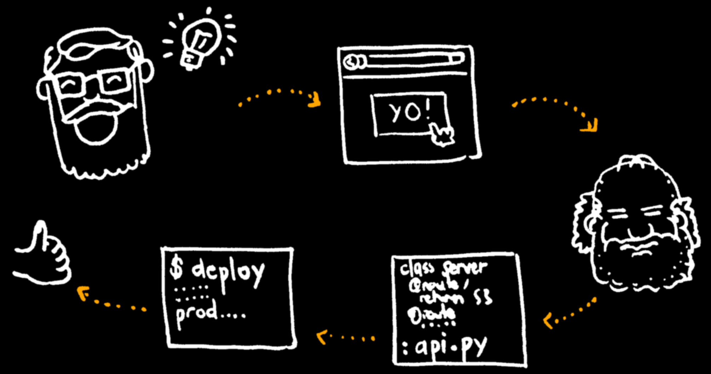
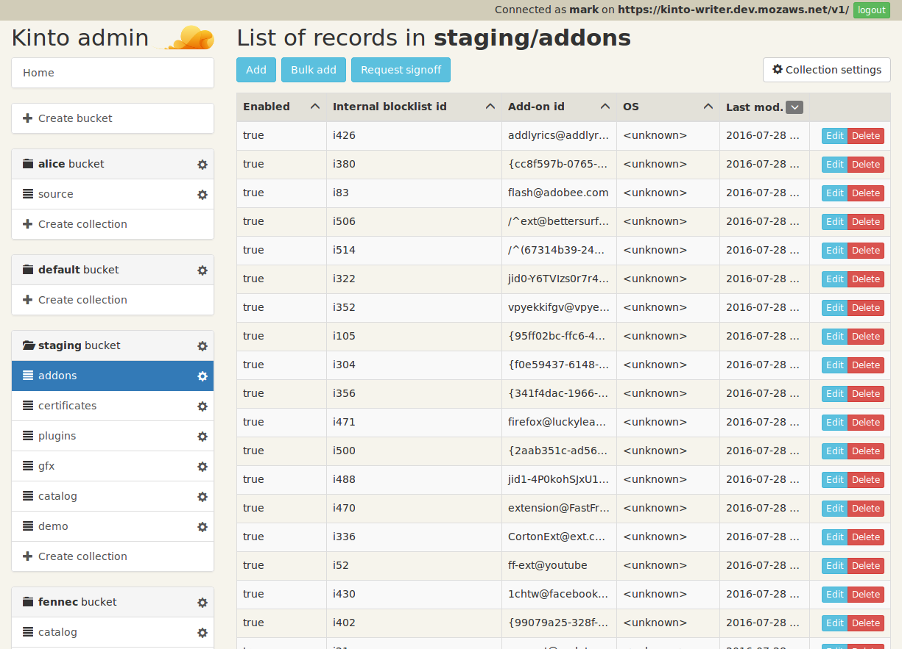
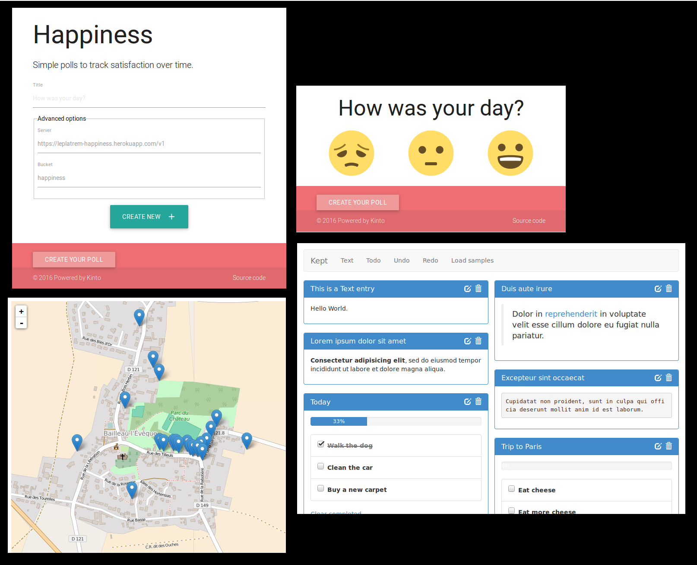
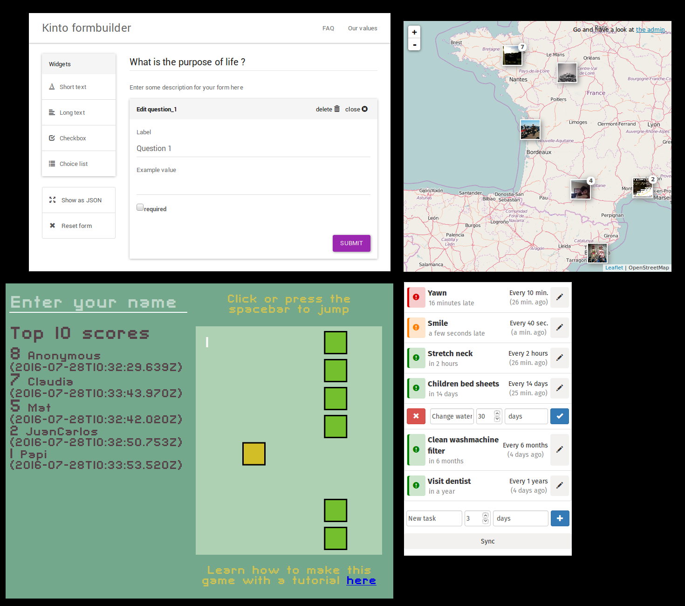
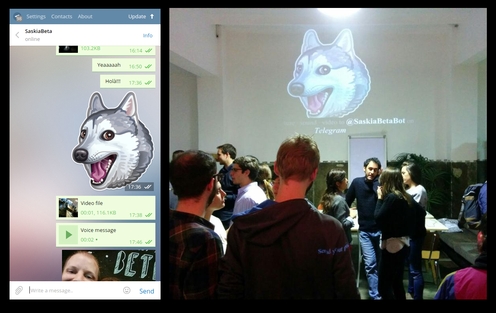

.. |br| raw:: html

    

**Kinto** is a minimalist JSON storage service |br| *(store, sync, share)*

* Python Meetup Barcelona
* July 2016
* https://kinto.readthedocs.io

----

Highlights
==========

* Why ?
* How ?
* About Pyramid

----

Why ?
=====

----

Storage API
===========

* Universal « Web database »
* Synchronize between devices
* Shareable remote storage
* Minimalist & simple

----

Your data, your choice
======================

.. image:: images/island-unhosted.png
    :align: right

Data belong to the users |br| *(not app developers)*

* Decouple application from storage location *(https://unhosted.org)*
* Self-hosting / Mutualisation
* Location of **your choice**
* Client side encryption

----

Synchronization
===============

* Live access and sharing
* Collaborative apps
* Offline-first
* Progressive Web Apps

----

Universal means reusable!
=========================

.. image:: images/overview-use-cases.png
    :align: right

* Capitalize
* Secure once
* Deploy once
* Scale once

----

New idea → Production ?
=======================

----

With Kinto:

* Relax app developers!
* Speed-up prototyping
* Bypass backend devs/ops

Featured on Hackernews as *«Self-hostable alternative to Parse and Firebase»*

----

How ?
=====

----

HTTP API
========

* Hierarchy of REST resources |br| *(buckets > collections > records)*
* Fined-grained permission tree

----

HTTP API
========

* Arbitrary JSON records
* Polling for changes
* Filtering + Sorting + Paginating
* Cache and concurrency control
* Optional JSON schema validation
* *Versioning*
* *Deprecation*
* *...*

----

Core
====

* Everything pluggable from settings |br| *(auth, backends, ...)*
* Plain INI files + ENV vars
* Built-in monitoring
* HTTP API best practices

----

Plugins
=======

Examples of available addons:

* Push notifications
* File attachments
* History of changes
* Digital signatures (crypto)
* LDAP authentication
* ...

----

Records storage
===============

PostgreSQL backend *(recommended)*:

* SQLAlchemy *(engine, pools, transactions, ...)*
* Single table with JSONB *(raw SQL queries)*
* Per-request transactions
* Minimalist DB schema migrations logic
* Flat and easy to shard

----

Permissions
===========

* Pluggable (multi)-authentication «policies»
* Permission backend *(ACLs)*
* Intersection of «principals» *(~roles)*

----

Other pluggable backends
========================

* Key/value cache with «Time-To-Live» |br| *(Memory, Redis, ...)*
* File storage |br| *(filesystem, Amazon S3, ...)*
* StatsD monitoring
* Async events/tasks |br| *(Redis queue)*

----

Open source
===========

* 40+ contributors
* 2800+ stargazers
* Monthly community meetings
* Docker image
* 100% code coverage

----

Clients
=======

* Python (abstraction on top of ``requests``)

.. code-block:: python

    from kinto_client import Client

    client = Client(server="https://kinto.dev.mozaws.net/v1")
    client.get_records(bucket="blog", collection="articles")

* JavaScript (Promises + ES6)
* Offline-first (IndexedDB)
* Web Admin UI (React/Redux+Sagas)

----

kinto-admin Web UI

----

At Mozilla
==========

* https://firefox.settings.services.mozilla.com/
* Certificates Revocation List *(Firefox Nightly)*
* Android extra assets files |br| *(fonts, hyphenation dictionaries, ...)*
* A/B testing *(experiments)*
* ...

Coming soon: Web Extensions ``storage.sync()`` API

----

Community apps...

----

http://fourmilieres.net → Forms service!

----

Telegram Wall idea by Xavier Orduña |br| *PyBCN Meetup Nov 2015*

----

About Pyramid
=============

----

Key properties
==============

* «Pay for what you eat»
* Very stable API
* Good patterns

* Flexibility
* Extensibility

----

The ``main`` entry point:

.. code-block:: python

    from pyramid.config import Configurator

    def main(**settings):
        config = Configurator(settings=settings)

        # Initialization steps using `config`.

        return config.make_wsgi_app()

With a minimalist ``app.wsgi`` file:

.. code-block:: python

    from myapp import main

    config = configparser.ConfigParser()
    config.read('config.ini')

    application = main(**dict(config.items('app:main')))

----

Explict initialization
======================

Imperative

* Less magic
* Reproductible / testable

.. code-block:: python

    config.add_route('hello', '/')
    config.add_view(view_hello, route_name='hello')

Declarative with decorators:

.. code-block:: python

    @view_config(route_name='hello')
    def view_hello(request):
        return {"hello": "pybcn"}

(+ explicit ``config.scan()``)

----

Configuration is the project «backbone»

.. code-block:: python

    # Map URLs to views
    config.add_route()
    config.add_view()

    # Setup authn/authz
    config.set_authentication_policy()
    config.set_authorization_policy()

    # Add event subscriber
    config.add_subscriber()

    # Add custom response renderers
    config.add_renderer()
    config.add_response_adapter()

    # ...and more!

----

Extensibility
=============

Include any package:

.. code-block:: python

    config.include('cornice')

Or via the settings:

.. code-block:: ini

    pyramid.includes = webmaps_addon

Can be used to modularize any application part like views or event subscribers.

----

An addon is just a single Python module with a flat ``def includeme(config)``:

.. code-block:: python

    def includeme(config):
        # Add custom view renderer.
        config.add_renderer(name='geojson',
                            factory='webmaps.GeoJSONRenderer')

* No magic *(e.g. import side-effect)*
* Plugin system out-of-the-box
* https://github.com/uralbash/awesome-pyramid

----

Application settings
====================

* Plain INI settings files
* No sorcery at execution time |br| *(c.f. settings.py, conf.py)*
* OPS friendly

----

Python modules from settings
============================

.. code-block:: ini

    # config.ini
    cache_backend = mypackage.cache

Easily load modules from settings files:

.. code-block:: python

    # main.py
    settings = config.get_settings()
    cache_mod_name = settings['cache_backend']

    cache_module = config.maybe_dotted(cache_mod_name)
    backend = cache_module.Cache(settings=settings)

----

Services
========

Declare interfaces and register components:

.. code-block:: python

    from pyramid.interfaces import IRoutesMapper

    mapper = DummyRoutesMapper()
    config.registry.registerUtility(mapper, IRoutesMapper)

Other parts of the code can query the registry:

.. code-block:: python

    route_mapper = request.registry.queryUtility(IRoutesMapper)
    info = route_mapper(request)

----

Hook everything
===============

Application initialization:

* Powerful route/views mapping *(predicates)*
* Events, callbacks, tweens, adapters, renderers, ...
* Pyramid internals via interfaces

----

Events / Subscribers
====================

.. code-block:: python

    class ServerFlushed(object):
        def __init__(self, request, timestamp):
            self.request = request
            self.timestamp = timestamp

Trigger event from view:

.. code-block:: python

    from .events import ServerFlushed

    def view_flush_post(request):
        request.registry.storage.flush()

        event = ServerFlushed(request, timestamp=datetime.now())
        request.registry.notify(event)

        return {"status": "ok"}

-----

Subscribe to event during initialization:

.. code-block:: python

    def on_server_flush(event):
        request = event.request
        # Add header to response
        request.response.headers['Alert'] = 'Flush'

    config.add_subscriber(on_server_flush, ServerFlushed)

* Alter responses
* Raise HTTP exceptions *(eg. quotas, etc.)*

Executed **synchronously** → use job queue for long tasks

----

Custom abstractions
===================

Example of domain specific initialization method:

.. code-block:: python

    def add_api_capability(config, identifier, description=""):
        capability = dict(description=description)
        # The application registry is a singleton
        config.registry.api_capabilities[identifier] = capability

    config.add_directive('add_api_capability', add_api_capability)

New initialization directive becomes available:

.. code-block:: python

    config.add_api_capability('history', description="History plugin")

----

This view exposes what plugins have registered via our custom method:

.. code-block:: python

    @view_config(route_name='hello')
    def get_hello(request):
        data = {
            'capabilities': request.registry.api_capabilities
        }
        return data

Craft your own special-purpose, domain-specific Web system → *«framework framework»*

-----

Testing
=======

.. code-block:: python

    from myapp import main

    class PluginSetupTest(unittest.TestCase):
        settings = {
            'pyramid.includes': 'extra_plugin'
        }

        def __init__(self, *args, **kwargs):
            super(WebTest, self).__init__(*args, **kwargs)
            wsgi_app = testapp(self.settings)
            self.app = webtest.TestApp(wsgi_app)
            self.headers = {"Content-Type": "application/json"}

        def test_capability_is_shown_in_hello_view(self):
            resp = self.app.get("/hello", headers=self.headers)
            assert "extra_plugin" in resp.json["capabilities"]

-----

Compose vs. inherit
===================

.. code-block:: python

    class MyAuthz(Authorization):
        def permits(self):
            permits = super(MyAuthz, self).permits()
            return permits and custom_check()

With inheritance, substitution occurs before instantiation.

With composition, we can do:

.. code-block:: python

    class Authorization:
        def permits(self):
            return self.context.is_allowed()

    authz.context = MyContext()

----

Prefer composition because:

* Readability
* Flexibility
* Single responsability principle
* Composition of uncoupled packages
* Avoid multiple inheritance *(eg. mixins)*

-----

Downsides
=========

* Pyramid is not the «latest cool stuff»
* Projects not always active *(but just works)*
* Documentation lacks «real-life examples» |br| *(e.g. ACL)*
* Easy to couple everything to ``request``
* Built-in authentication policies are not intuitive

-----

Gràcies!
========

* https://trypyramid.com
* https://kinto.readthedocs.io |br| *(IRC, Slack, mailing-list...)*
* ``@leplatrem`` *(twitter, github, ...)*

-----

