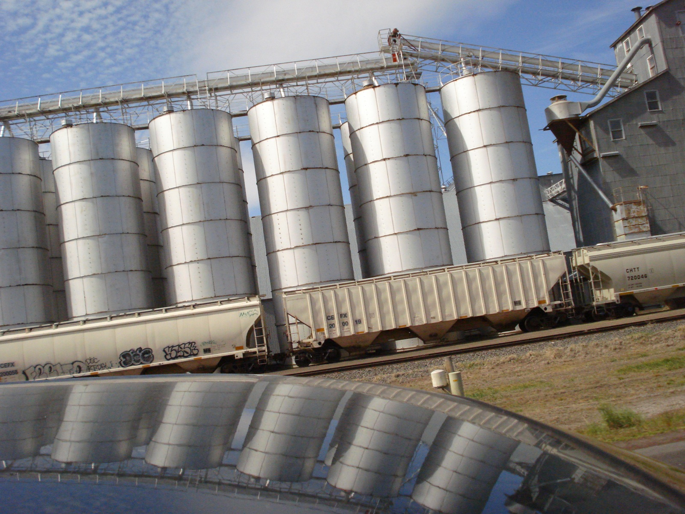
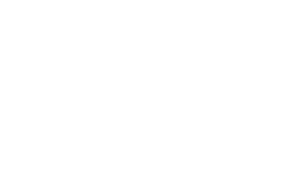
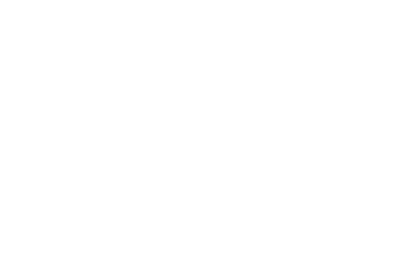
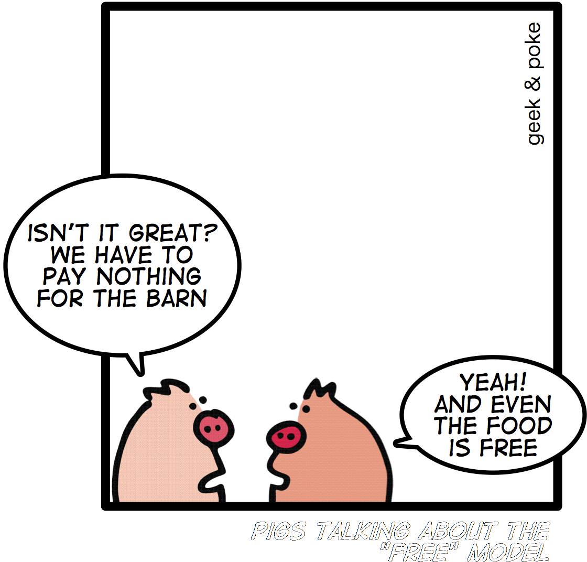
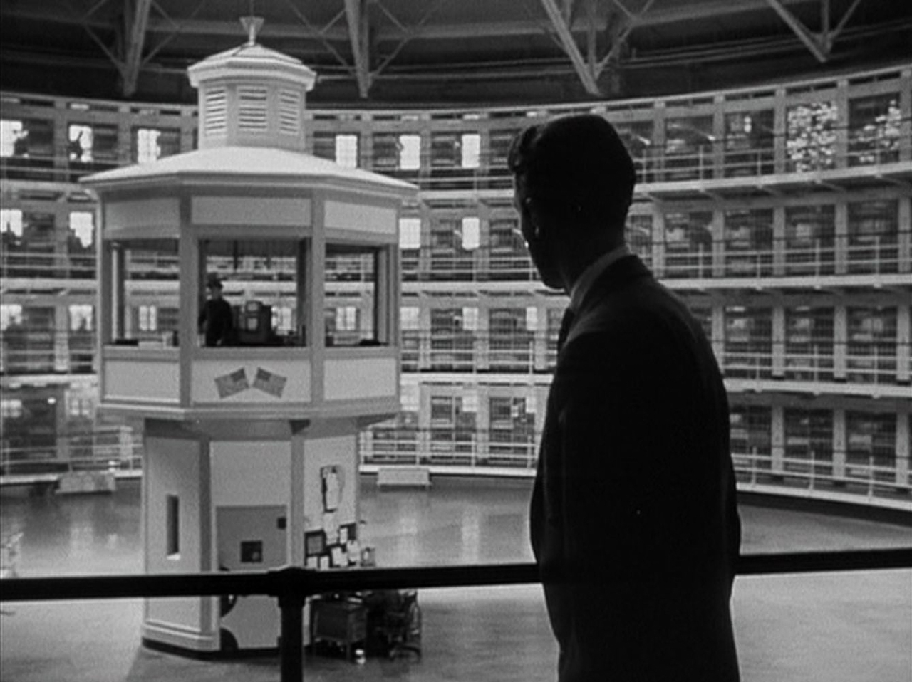
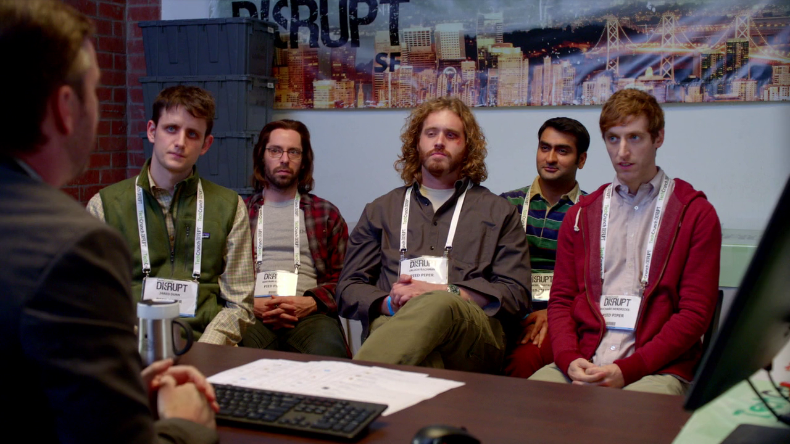
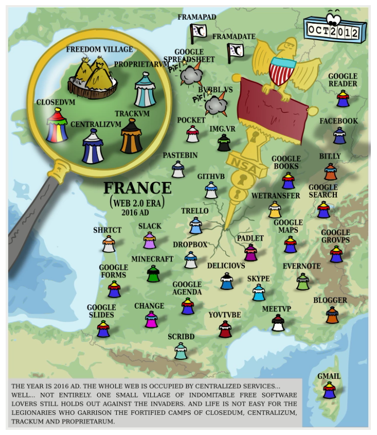
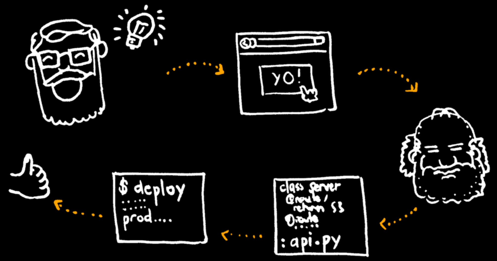

.. |br| raw:: html

    

« Don't build silos »
=====================

* Betahaus Lunch & Learn
* November 2016

----

A «silo» is...
==============

----

Why?
====

----

Internet was made by dreamers
=============================

* Utopists of 1960s
* Military tech made by hippies
* Impossible to shut down
* → No single point of failure
* → Impossible to control

----

1970-2000
=========

----

2000-2016
=========

----

«in the Cloud»
==============

.. image:: images/someone-else-computer.png

----

Typical cloud service
======================

#. Offer tool for free
#. Collect usage data
#. Track users interests and habits
#. Improve user experience
#. Sell user data to advertisement companies

----

 ... treat users as salami!

----

Proprietary cloud silos
=======================

* User data is money
* Sold along with companies
* Value of company ∝ amount of user data

----

Why is it bad?
==============

* No control on collection
* No control on usage
* No interoperability
* No take out

----

«*We're trading invaluable personal data against cheap services*» — Tristan Nitot, Cozycloud

Ex: Facebook costs roughly $5 a year per user

----

Why should I care?
==================

----

Less resilience
===============

Freedom of speech & related...

* Censorship
* Take down
* Bankrupt business

----

Less privacy
============

* Centralization makes mass surveillance feasible
* GAFAM *(Google Amazon Facebook Apple Microsoft)*

«*Surveillance is the Business Model of the Internet*» — Bruce Schneier

----

Less fun
========

* Less actors
* Less confidence... |br| *(No singing out of shower)*
* Less creativity

----

Less innovation
===============

* More power to big actors
* Harder to compete

----

How?
====

----

Data under control
==================

* Developer builds application
* Manufacturer builds device
* Data belong to you
* Data goes to a location of **your choice**

----

Personal clouds
===============

* Cheap hardware *(Raspberry, 35€)*
* Data is encrypted
* Personal data can be mixed **under your control**

----

New business models
===================

* Open Source Software as a service
* Decentralized Applications *(Dapp, blockchains)*
* Mutual ownership *(cooperatives)*
* Contributors get paid by users *(Collaborative)*

----

* https://redecentralize.org
* https://www.decentralizedweb.net

----

About Kinto
===========

----

Generic storage
===============

* Web / Mobile / IoT
* Open source
* HTTP API + ecosystem
* Pluggable development kit

----

New idea → Production ?
=======================

----

With Kinto:

* Relax app developers!
* Speed-up prototyping
* Bypass backend devs/ops

-----

http://kinto-storage.org

-----

Other solutions
===============

* http://pouchdb.com
* https://cozy.io
* https://kuzzle.io
* https://parse.com
* https://owncloud.org / https://nextcloud.com
* https://yunohost.org

----

Web of the future
=================

* https://ipfs.io
* https://openbazaar.org
* https://www.ethereum.org
* http://akasha.world

-----

Gràcies!
========

* Mateo, 3rd floor :)
* ``@leplatrem`` *(twitter, github, ...)*

-----

